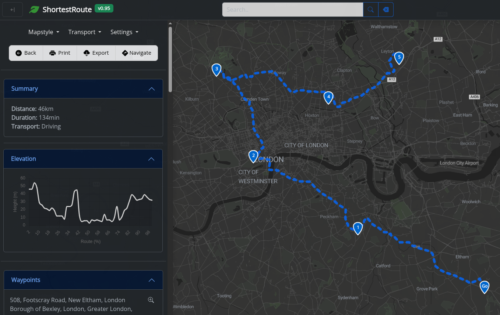

# ShortestRoute v0.95

**ShortesRoute** is an open‐source, browser-based route planner that helps you find the optimal path for two or more stops using interactive maps. It supports multiple routing profiles—walking, biking, driving—and provides detailed directions, travel times, and the ability to export your routes in various formats (PDF, GPX, etc.).

---

## Table of Contents

1. [Demo & Screenshots](#demo--screenshots)  
2. [Features](#features)  
3. [Tech Stack & Dependencies](#tech-stack--dependencies)  
4. [Getting Started](#getting-started)  
5. [Usage](#usage)  
6. [Configuration](#configuration)  
7. [Extending & Customization](#extending--customization)  
8. [Troubleshooting](#troubleshooting)  
9. [License](#license)  
10. [Acknowledgments](#acknowledgments)  

---

## Screenshot



---

## Features

- **Multiple Waypoint Optimization**  
  Calculate the shortest or fastest route for two or more waypoints.
- **Routing Profiles**  
  Support for walking, cycling, and driving.
- **Interactive Map Controls**  
  - Zoom, pan, fullscreen toggle  
  - MiniMap inset  
  - Detail-level switches  
  - Real-time weather overlay
- **Live Location**  
  “Locate me” control to center the map on your current position.
- **Export Options**  
  - Download route as GPX  
  - Generate PDF with embedded map & turn-by-turn directions  
- **Data Visualization**  
  Chart.js integration for displaying elevation/profile or time-distance graphs.
- **CSV Import**  
  Batch-upload waypoints from CSV via PapaParse.
- **GDPR-Compliant Cookie Consent**  
  Integrated cookie banner.

---

## Tech Stack & Dependencies

### Core Libraries

- **Leaflet** (v1.9.3) – interactive maps  
- **Leaflet Routing Machine** – route drawing & waypoint management  
- **Leaflet Plugins**  
  - Providers, RainViewer, OSMBuildings, Beautify-Marker, Detail Level, Minimap, Fullscreen, Locate Control, Simple Map Screenshoter
- **Bootstrap** (v5.3) + **Bootstrap Icons** – UI components  
- **FontAwesome** – additional icons  

### Utilities

- **Axios** – HTTP requests (e.g., route APIs)  
- **Chart.js** – graphing route stats  
- **PapaParse** – CSV parsing  
- **html2pdf.js** – PDF export  
- **togpx.js** – GPX conversion  
- **vanilla-hCaptcha** – bot protection  
- **goatcounter** – simple analytics  

---

## Getting Started

### Prerequisites

- Modern web browser (Chrome, Firefox, Edge, Safari)  
- (Optional) Local HTTP server to avoid CORS when loading local assets  

### Installation

1. Clone this repository:  
   ```bash
   git clone https://github.com/passimon/shortest-route.git
   cd shortestroute
   ```
2. Serve the files locally. For example, using **http-server**:  
   ```bash
   npm install -g http-server
   http-server . -p 8080
   ```
3. Open `http://localhost:8080/index.html` in your browser.

---

## Usage

1. Open the app in your browser.  
2. Grant location access if you want the “Locate me” feature.  
3. Click on the map to add waypoints (or import via CSV).  
4. Choose your routing profile (walking, cycling, driving).  
5. Press “Calculate Route” to display the optimized path.  
6. View turn-by-turn directions in the sidebar.  
7. Export your route:  
   - **GPX** button  
   - **PDF** button  

---

## Configuration

Most configuration is done directly in `index.html` (or your custom main HTML file):

- **Map tile provider** – modify in `scripts/leaflet-providers.js`.  
- **Routing service** – by default it may use a public OpenRouteService endpoint. To switch to your own API key or different service, update the router options in `scripts/main.js`.  
- **Chart options** – located in the Chart.js initialization block.  
- **CookieConsent** – edit `styles/ext.cookieconsent.css` or initialize with your domain in the snippet.

---

## Extending & Customization

- **Add more Leaflet plugins** by including their CSS/JS in the `<head>`.  
- **Custom map styles** – swap out the tile-provider URL or add Mapbox/Carto styles.  
- **Localization** – wrap all UI labels in a JSON dictionary and load based on user locale.  
- **Theming** – override Bootstrap variables or drop in your own SCSS.  

---

## Troubleshooting

- **Map not loading / CORS errors**  
  - Ensure you’re serving via HTTP, not `file://`.  
  - Check console for blocked requests—update your API keys or proxy settings.
- **Routes failing**  
  - Verify your routing API key and endpoint URL.  
  - Inspect network calls in DevTools for detailed error messages.
- **Plugin conflicts**  
  - Make sure you’re including compatible versions of Leaflet and its plugins.

---

## License

This project is licensed under the MIT License.

---

## Acknowledgments

- Leaflet and the open-source mapping community  
- Contributors of the various Leaflet plugins used  
- HCaptcha for spam prevention  

Happy routing! 🚴‍♂️🗺️
